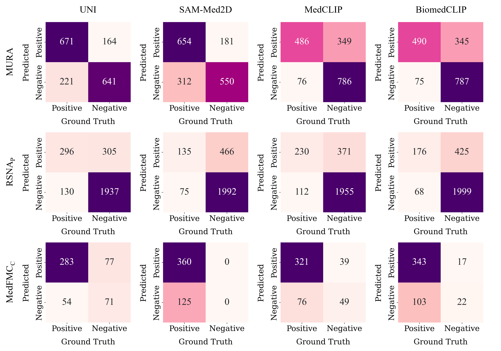

# PathRadX - "From Pathology to Radiology: Evaluating the Applicability of Pathology Foundation Models."

[](https://link.springer.com/book/10.1007/978-3-032-07845-2)
[](https://opensource.org/licenses/MIT)
[](https://www.python.org/downloads/)
[](https://pytorch.org/)

This is the official repository for the paper **"From Pathology to Radiology: Evaluating the Applicability of Pathology Foundation Models"**. 

## 📌 Introduction

Foundation models demonstrate strong adaptability across diverse tasks, but their applicability across different medical imaging modalities has not been well studied.
This repository introduces **PathRadX**, a cross-modal framework designed to evaluate the applicability of pathology foundation models to various classification tasks in radiology images. 

Our framework integrates modality adaptation and task-specific classification strategies for efficient cross-modal adaptation, demonstrating that pathology pre-trained models possess strong generalization capabilities for radiology imaging tasks.

**Authors:** [Hyun Yang](https://github.com/YH-Paradise), Sumin Jung, and [Jin Tae Kwak](https://kwaklab.net/)

---

## 🧠 Methodology

To fairly assess the generalization ability of the pathology foundation model (we use **UNI**), all pre-trained weights are frozen.
PathRadX addresses the modality gap (e.g., RGB pathology images vs. grayscale radiology images) and task differences through two main components:

### 1. Modality Adaptation
* **Channel Manipulation (CM):** Applies a 3x3 convolution layer to convert single-channel grayscale images into a three-channel format matching the foundation model's expected input.
* **Pseudo Coloring (PC):** Utilizes the RdPu colormap to map grayscale intensity values into a color space that mimics the patterns of H&E stained pathology images.

### 2. Task-Specific Classification
* **Single Instance Learning (SIL):** Resizes radiology images to 224x224 pixels and feeds them directly into the image encoder to extract features.
* **Multiple Instance Learning (MIL):** Crops images into multiple overlapping 224x224 patches, processes each independently, and aggregates the features using attention-based MIL (AB-MIL).

<p align="center">
  
  <br>
  <em><b>Fig. 1: Overview of the proposed PathRadX framework.</b></em>
</p>


## 🚀 Getting Started

### Prerequisites
```bash
# Clone the repository
git clone https://github.com/YH-Paradise/PathRadX.git
cd PathRadX

# Create a virtual environment and install dependencies
conda create -n pathradx python=3.10 -y
conda activate pathradx
pip install -r requirements.txt
```

---

### Prepare Datasets
We evaluated the PathRadX framework on three diverse radiology datasets:
* **[MURA](https://stanfordmlgroup.github.io/competitions/mura/):** Musculoskeletal radiographs (40,005 images).
* **[RSNA (RSNA Pneumonia)](https://www.kaggle.com/competitions/rsna-pneumonia-detection-challenge):** Chest X-ray images for pneumonia detection (26,684 images).
* **[MedFMC](https://www.nature.com/articles/s41597-023-02460-0):** Chest X-ray images for thoracic abnormality classification (4,848 images).

```bash
# Example command for preparing dataset, especially MURA dataset.
python ./data/prepare_datasets.py --dataset_name "MURA"
```

---

### Prepare Pretrained Weights
PathRadX uses frozen pretrained model backbones. Download each model's weights and place them in the corresponding `model_weights/{model_name}/` directory.

| Model | Download | Filename | Destination |
|:------|:---------|:---------|:------------|
| [UNI](https://huggingface.co/MahmoodLab/UNI) | HuggingFace (requires access request) | `pytorch_model.bin` | `model_weights/uni/` |
| [SAM-Med2D](https://github.com/OpenGVLab/SAM-Med2D?tab=readme-ov-file#model-checkpoints) | GitHub Releases | `sam-med2d_b.pth` | `model_weights/sammed2d/` |
| [MedCLIP](https://huggingface.co/flaviagiammarino/pubmed-clip-vit-base-patch32) | HuggingFace | `pytorch_model.bin` | `model_weights/medclip/` |
| [BiomedCLIP](https://huggingface.co/microsoft/BiomedCLIP-PubMedBERT_256-vit_base_patch16_224) | Auto-downloaded via HuggingFace Hub | — | — |

> **Note:** BiomedCLIP weights are downloaded automatically at runtime via `open_clip`. No manual download is required.

After downloading, update `configs/datasets/rsna.yaml` with your local dataset path if using the RSNA dataset.

---

### Training & Evaluation

```bash
# Train: UNI + Channel Manipulation + MIL (best configuration)
python main.py --dataset mura --model uni --adaptation cm --classification mil

# Train: UNI + Pseudo Coloring + SIL
python main.py --dataset mura --model uni --adaptation pc --classification sil --epochs 50 --batch_size 64 --lr 0.001

# Evaluate a trained model
python evaluate.py --dataset mura --model uni --adaptation cm --classification mil --weight_path runs/uni_mura_cm_mil/20250101-000000/best_val_epoch049.pt
```

**Arguments:**
- `--dataset`: `mura` | `rsna` | `medfmc`
- `--model`: `uni` | `medclip` | `sammed2d` | `biomedclip`
- `--adaptation`: `cm` (Channel Manipulation) | `pc` (Pseudo Coloring)
- `--classification`: `sil` (Single Instance Learning) | `mil` (Multiple Instance Learning)

**W&B logging** (optional): set `WANDB_API_KEY` environment variable and pass `--wandb` flag.

---

## 📊 Results

We compared PathRadX against three radiology-specific foundation models: SAM-Med2D, MedCLIP, and BiomedCLIP.

### Accuracy
*Table 1. Performance evaluation based on Accuracy.*

| Models     |   MURA    | RSNA<sub>P</sub> | MedFMC<sub>C</sub> |
|:-----------|:---------:|:----------------:|:------------------:|
| UNI        | **0.773** |    **0.837**     |       0.730        |
| SAM-Med2D  |   0.709   |      0.797       |       0.742        |
| MedCLIP    |   0.750   |      0.819       |     **0.763**      |
| BiomedCLIP |   0.753   |      0.815       |       0.753        |


### F1
*Table 2. Performance evaluation based on F1*

| Models     |   MURA    | RSNA<sub>P</sub> | MedFMC<sub>C</sub> |
|:-----------|:---------:|:----------------:|:------------------:|
| UNI        | **0.777** |    **0.576**     |       0.812        |
| SAM-Med2D  |   0.726   |      0.333       |     **0.852**      |
| MedCLIP    |   0.696   |      0.488       |       0.848        |
| BiomedCLIP |   0.700   |      0.417       |       0.851        |


### AUC
*Table 3. Performance evaluation based on AUC*

| Models     |   MURA    | RSNA<sub>P</sub> | MedFMC<sub>C</sub> |
|:-----------|:---------:|:----------------:|:------------------:|
| UNI        | **0.861** |    **0.863**     |       0.768        |
| SAM-Med2D  |   0.788   |      0.809       |       0.757        |
| MedCLIP    |   0.844   |      0.834       |     **0.784**      |
| BiomedCLIP |   0.835   |      0.820       |       0.762        |


* Leveraging the UNI model with AB-MIL and channel-manipulation achieved the highest accuracy, F1 score, and AUC scores for the MURA and RSNAP datasets.
* Overall, our proposed method demonstrated more balanced and reliable classification performance, particularly on highly imbalanced datasets.

<p align="center">
  
  <br>
  <em><b>Fig. 1: Overview of the proposed PathRadX framework.</b></em>
</p>

---

## 🔬 Ablation Study
*Table 4. A comparison of UNI’s performance on F1 score, using different strategies, single instance learning (SIL), multiple
instance learning (MIL), channel manipulation (CM), and pseudo-coloring (PC).*

| SIL | MIL | CM | PC |  MURA F1  | RSNA<sub>P</sub> F1 | MedFMC<sub>C</sub> F1 |
|:---:|:---:|:--:|:--:|:---------:|:-------------------:|:---------------------:|
|  ✓  |     | ✓  |    |   0.752   |        0.357        |         0.870         |
|  ✓  |     |    | ✓  |   0.744   |        0.348        |       **0.873**       |
|     |  ✓  | ✓  |    | **0.777** |      **0.576**      |         0.812         |
|     |  ✓  |    | ✓  |   0.753   |        0.540        |         0.852         |


## 📝 Citation

If you find this code or our framework useful in your research, please consider citing:

```bibtex
@inproceedings{yang2025pathradx,
  title={From Pathology to Radiology: Evaluating the Applicability of Pathology Foundation Models},
  author={H. Yang, S. Jung, and J. T. Kwak},
  booktitle={MICCAI},
  year={2025}
}
```

---

## 🤝 Acknowledgements

* This work was supported by a grant of the National Research Foundation of Korea (NRF) (No. RS-2025-00558322) and the Ministry of Health and Welfare of Korea (No. RS-2023-00266130).
* Affiliations: School of Electrical and Electronic Engineering, Korea University & DeepClue Inc..